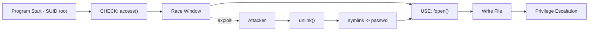
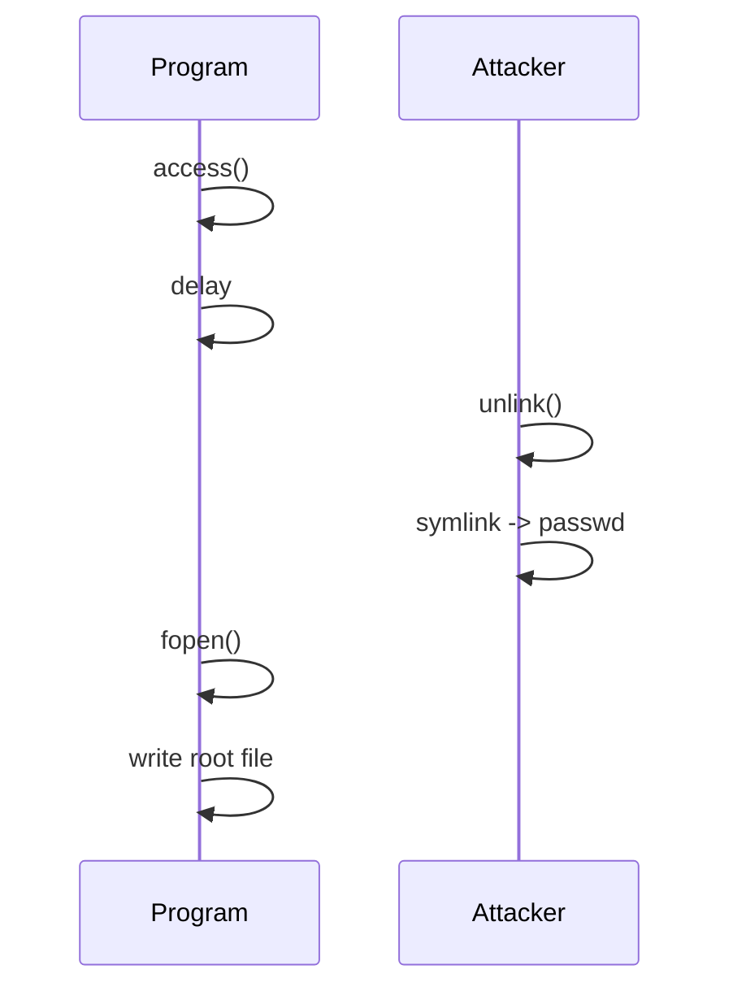
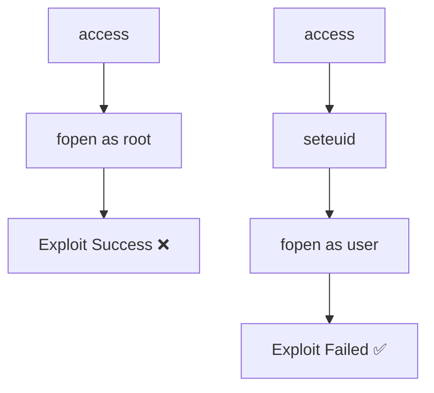

# Lab Report: Exploiting TOCTOU Race Condition Vulnerability


***

## 1. GIỚI THIỆU

**Race Condition** là lỗ hổng xảy ra khi kết quả chương trình phụ thuộc vào timing và thứ tự thực thi.

Trong lab này, tập trung vào **TOCTOU (Time-Of-Check to Time-Of-Use)** — lỗi phổ biến khi thao tác với file path.

### Cơ chế lỗi

1. **Check** – kiểm tra quyền truy cập  
2. **Race Window** – khoảng thời gian trống  
3. **Use** – sử dụng lại đường dẫn  

***

## 📊 Attack Flow



***

## 2. MỤC TIÊU LAB

- [x] Hiểu TOCTOU  
- [x] Xác định race window  
- [x] Exploit thành công  
- [x] Ghi file root bằng SUID  
- [x] Kiểm chứng fix  

***

## 3. MÔ HÌNH LAB

| Thành phần            | Vai trò | Mô tả          |
|----------------------|--------|----------------|
| `passwd`             | Target | File root      |
| `vulnerable-program` | Victim | SUID program   |
| `symbolic-link`      | Attack | Tạo symlink    |
| `exploit.sh`         | Script | Tự động attack |

***

## 4. CÁC BƯỚC THỰC HIỆN

### 4.1 Thiết lập môi trường

```bash
sudo adduser lab2
su - lab2
mkdir ~/lab2 && cd ~/lab2
```

### 4.2 Biên dịch & SUID

```bash
sudo su
cd /home/lab2/lab2

clang vulnerable-program.c -o vulnerable-program
clang symbolic-link.c -o symbolic-link
clang vulnerable-program-fix.c -o vulnerable-program-fix

chmod u+s vulnerable-program
chmod u+s vulnerable-program-fix

echo "This is a file owned by root" > passwd
echo "password root is 123root" >> passwd

exit
```

### 4.3 Chạy exploit

```bash
chmod 755 exploit.sh exploit-fix.sh
./exploit.sh
```

***

## 5. KẾT QUẢ

```text
TOCTOU-Attack-Success
```

***

## 6. PHÂN TÍCH

```c
if (!access(fileName, W_OK)) {
    for (i = 0; i < DELAY; i++) {
        int a = i ^ 2;
    }

    fopen(fileName, "a+");
}
```

***

## 🔁 Timeline Attack



***

## 7. KHẮC PHỤC

```c
seteuid(getuid());
```

***

## 🔐 So sánh



***

## 8. KẾT LUẬN

- Exploit thành công  
- Ghi file root thành công  
- Fix hoạt động  

***

## 🔒 Best Practices

- Dùng `open()` + `fstat()`  
- Tránh `access()`  
- Hạn chế SUID  
- Drop privilege sớm  

***
